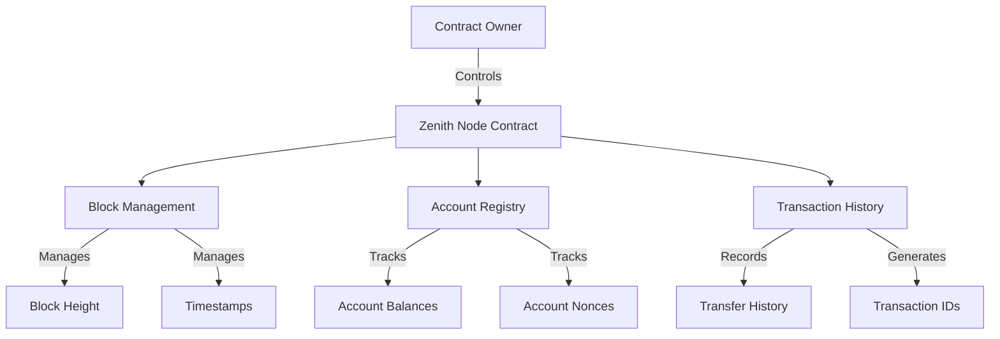

# Zenith Dev Node

A simplified blockchain environment specifically tailored for Clarity smart contract developers, providing fast and resource-efficient testing capabilities.

## Overview

Zenith Dev Node creates a controlled development environment that simulates blockchain behavior without requiring connection to the actual Stacks blockchain. It enables developers to:

- Simulate blockchain operations with predictable outcomes
- Control block height and timestamps
- Manage test accounts and balances
- Track transaction history
- Test time-dependent contract logic

The system provides a lightweight alternative to running a full node while maintaining the core functionality needed for contract development and testing.

## Architecture

The Zenith Dev Node consists of a main contract that manages the simulated blockchain environment. It implements:



### Core Components:
- Block Management System
- Account Registry
- Transaction History Tracker
- Administrative Controls

## Contract Documentation

### Zenith Node Contract

The main contract (`zenith-node.clar`) manages the entire simulated environment.

#### Key Features:
- Account management with balance tracking
- Block height and timestamp control
- Transaction simulation and history
- Environment pause/resume functionality

#### Access Control:
- Contract owner has exclusive access to administrative functions
- Public read-only functions available to all users
- Transfer operations require registered accounts

## Getting Started

### Prerequisites
- Clarinet
- Stacks CLI tools

### Installation

1. Clone the repository
2. Install dependencies
```bash
clarinet integrate
```

### Basic Usage

1. Initialize the environment:
```clarity
(contract-call? .zenith-node init-environment)
```

2. Register a test account:
```clarity
(contract-call? .zenith-node register-account 'ST1PQHQKV0RJXZFY1DGX8MNSNYVE3VGZJSRTPGZGM 1000)
```

3. Simulate transfers:
```clarity
(contract-call? .zenith-node simulate-transfer 
    'ST1PQHQKV0RJXZFY1DGX8MNSNYVE3VGZJSRTPGZGM 
    'ST2CY5V39NHDPWSXMW9QDT3HC3GD6Q6XX4CFRK9AG 
    100 
    none)
```

## Function Reference

### Administrative Functions

```clarity
(init-environment) -> (response bool)
(register-account (address principal) (initial-balance uint)) -> (response bool)
(set-pause-state (paused bool)) -> (response bool)
(fund-account (address principal) (amount uint)) -> (response bool)
```

### Block Management

```clarity
(advance-blocks (blocks uint)) -> (response uint)
(mine-block) -> (response uint)
(set-timestamp (new-timestamp uint)) -> (response uint)
```

### Account Operations

```clarity
(simulate-transfer (sender principal) (recipient principal) (amount uint) (memo (optional (string-ascii 256)))) -> (response uint)
(reset-account (address principal) (new-balance uint)) -> (response bool)
```

### Read-Only Functions

```clarity
(get-block-height) -> uint
(get-timestamp) -> uint
(get-account-details (address principal)) -> {balance: uint, nonce: uint, created-at-block: uint}
(get-transaction (tx-id uint)) -> optional transaction-data
```

## Development

### Testing

Run the test suite:
```bash
clarinet test
```

### Local Development

1. Start Clarinet console:
```bash
clarinet console
```

2. Deploy contract:
```bash
clarinet deploy
```

## Security Considerations

### Limitations
- Simulated environment only - not for production use
- Simplified timing model (10-minute block times)
- No actual consensus mechanism

### Best Practices
- Reset environment between test runs
- Use unique test accounts for different scenarios
- Verify transaction success through return values
- Monitor account nonces for transaction ordering
- Always check function return values for errors